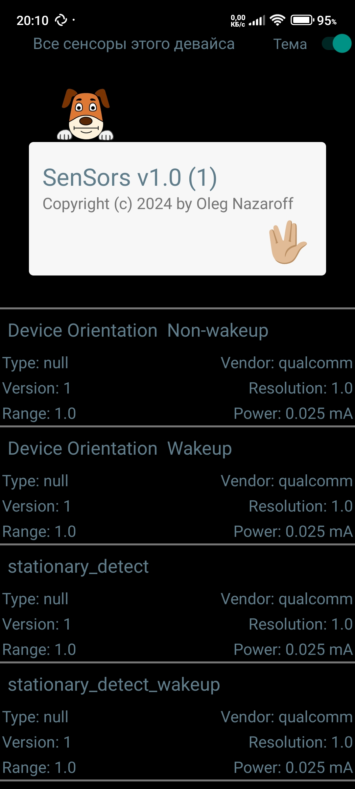
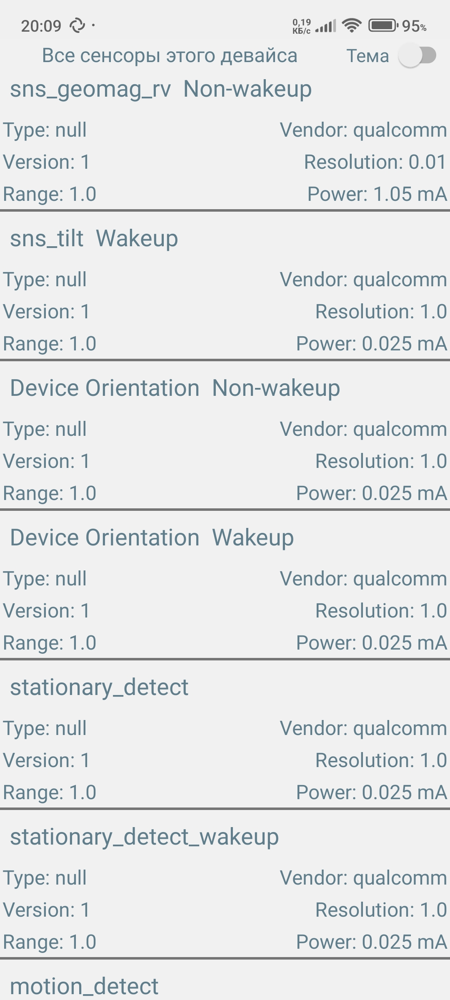

# SenSors
All sensors of the Android device with their readings. It was created for informational purposes.

## Features:

- [x] dark/light theme
- [x] swipe management
- [x] Русский язык (кроме данных с датчиков)

### Screenshots

 

<!--

-->

### Requirements
Android v8-13+

<!--
### Regards

### Known problems [fixed]
- [x] none (yet? ;)
-->
